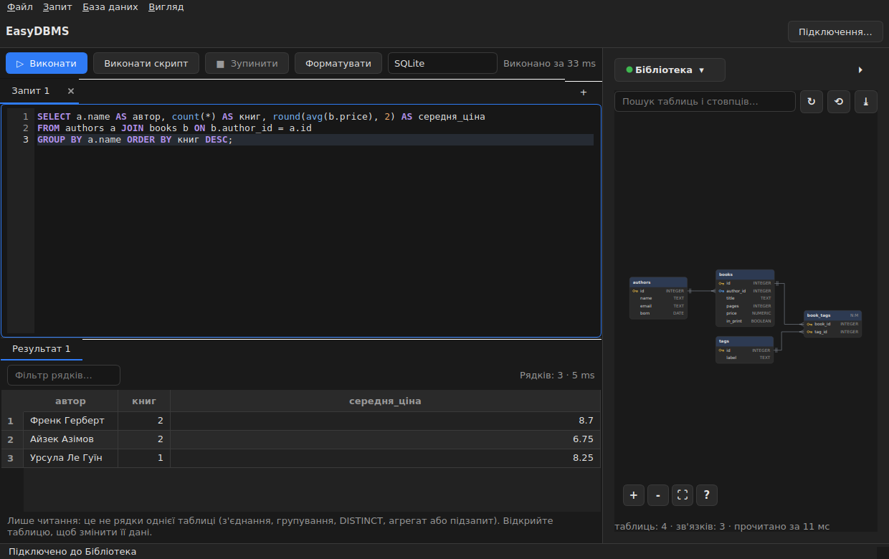
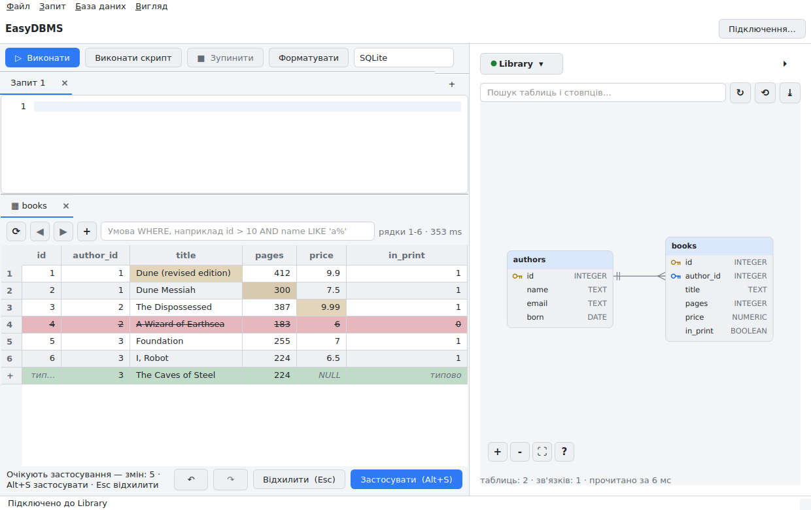
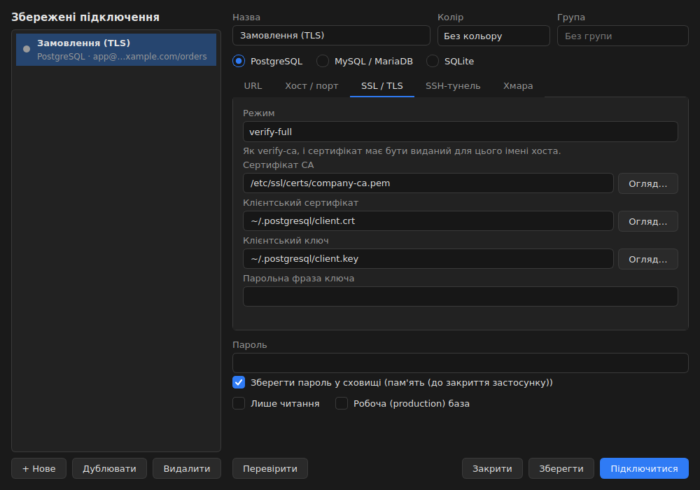

# EasyDBMS

[English](README.md) · **Українська**

Настільний клієнт баз даних для **PostgreSQL**, **MySQL / MariaDB** і **SQLite**. Пишіть SQL з розумним
автодоповненням, дивіться на базу як на ER-діаграму, редагуйте дані в таблиці й переглядайте кожну зміну перед
записом. Працює на Windows, macOS і Linux, українською та англійською мовами, з темною та світлою темою.

| ER-діаграма й редактор SQL | Перегляд правок перед записом | Налаштування підключення |
|---|---|---|
|  |  |  |

## Що можна робити

- **Підключатися до своїх баз.** Зберігайте скільки завгодно підключень, групуйте їх, позначайте кольором і
  перемикайтеся між ними з одного меню. Паролі зберігаються в системному сховищі (keyring) або в зашифрованому
  сховищі й ніколи не потрапляють у файл налаштувань. Кнопка «Перевірити» показує, на якому саме кроці виникла
  помилка: DNS, порт, вхід, TLS чи запит.
- **Підключатися безпечно.** SSL/TLS із сертифікатами CA та клієнта, SSH-тунель (пароль, ключ або ssh-agent, з
  проміжним вузлом), `~/.pgpass` і `pg_service.conf`, підстановки `${ENV_VAR}` і короткочасні токени для AWS RDS,
  Google Cloud SQL та Azure. Шаблони для Supabase, Neon, PlanetScale і CockroachDB Cloud.
- **Швидше писати SQL.** Вкладки, що переживають перезапуск, підсвічування синтаксису для вашого діалекту,
  автодоповнення таблиць, стовпців, псевдонімів і з'єднань, сніпети, форматування однією клавішею, кілька операторів
  у скрипті з окремою вкладкою результату для кожного, скасування будь-якої миті.
- **Бачити структуру.** ER-діаграма з первинними й зовнішніми ключами, зв'язками 1:1, 1:N і N:M, пошуком,
  масштабуванням і вибором схеми. Експорт у PNG, SVG, PDF, Mermaid або DBML.
- **Безпечно редагувати дані.** Змінюйте комірки, додавайте й видаляйте рядки просто в таблиці. Нічого не
  записується, доки ви не натиснете <kbd>Alt+S</kbd>: ви бачите згенерований SQL, усе виконується однією
  транзакцією, а рядок, який тим часом змінив хтось інший, зупиняє всю пачку замість того, щоб бути перезаписаним.
- **Зберігати свою роботу.** Кожен виконаний оператор потрапляє в історію з пошуком; ті, що повторюються, можна
  зберегти в папки.
- **Не нашкодити робочій базі.** Робочі підключення мають червону смугу й питають підтвердження перед зміною даних;
  небезпечні оператори (`DROP`, `TRUNCATE`, `DELETE` чи `UPDATE` без умови) теж питають; підключення можна зробити
  лише для читання.

## Підтримувані бази даних

| База даних | Перевірені версії | Примітки |
|---|---|---|
| PostgreSQL | 16 | Схеми, TLS, SSH, `~/.pgpass`, `pg_service.conf`, IAM-токени |
| MySQL / MariaDB | MariaDB 10.11 | TLS, SSH, IAM-токени |
| SQLite | 3.x | Файл на диску або `:memory:` |

SQL Server, Oracle і ClickHouse не підтримуються.

## Встановлення та запуск

Потрібен **Python 3.12 або новіший**. Швидкий шлях у терміналі:

```bash
git clone https://github.com/nkhp8djnyt-max/easy-db.git
cd easy-db
python -m venv .venv
. .venv/bin/activate              # Windows (PowerShell): .venv\Scripts\Activate.ps1
pip install -e ".[gui]"
python -m easydbms
```

У Linux Qt потребує кількох системних бібліотек; якщо вікно не відкривається, встановіть їх:

```bash
sudo apt install libegl1 libgl1 libxkbcommon0 libfontconfig1 libdbus-1-3 libxcb-cursor0
```

Додатково: `pip install -e ".[cloud]"` додає бібліотеки входу в AWS, Azure і Google (`[aws]`, `[azure]`, `[gcp]`
обирають одну). Щоб зібрати окрему папку із застосунком, виконайте `pip install -e ".[gui,build]"`, а потім
`python scripts/build_app.py`.

**Ваші перші п'ять хвилин**

1. Запустіть програму й натисніть **Підключення…** (<kbd>Ctrl+Shift+C</kbd>).
2. Натисніть **+ Нове**, виберіть **SQLite**, натисніть **Створити…** і вкажіть ім'я файлу. Або виберіть
   **PostgreSQL** чи **MySQL / MariaDB** і заповніть хост, користувача та базу даних.
3. Натисніть **Перевірити**, потім **Підключитися**.
4. Введіть у редакторі `SELECT 1;` і натисніть <kbd>Ctrl+Enter</kbd>. Праворуч з'явиться діаграма ваших таблиць.
5. Двічі клацніть таблицю на діаграмі, щоб переглянути її дані; двічі клацніть комірку, щоб змінити її, а потім
   натисніть <kbd>Alt+S</kbd>, щоб переглянути й записати зміну.

Повний посібник з усіма параметрами підключення — у **[посібнику користувача](docs/user-guide.uk.md)**.

## Клавіатурні скорочення

| Клавіші | Дія |
|---|---|
| <kbd>Ctrl+Shift+C</kbd> | Відкрити вікно підключень |
| <kbd>Ctrl+Enter</kbd> | Виконати виділене або поточний оператор |
| <kbd>F5</kbd> | Виконати весь скрипт |
| <kbd>Esc</kbd> | Зупинити запит, що виконується |
| <kbd>Ctrl+Space</kbd> | Показати підказки |
| <kbd>Ctrl+Shift+F</kbd> | Форматувати SQL |
| <kbd>Ctrl+T</kbd> / <kbd>Ctrl+W</kbd> | Нова / закрити вкладку запиту |
| <kbd>Ctrl+S</kbd> | Зберегти запит |
| <kbd>Ctrl+H</kbd> / <kbd>Ctrl+Shift+H</kbd> | Історія / збережені запити |
| <kbd>Alt+S</kbd> | Переглянути й записати правки з таблиці |
| <kbd>Ctrl+P</kbd> | Перейти до таблиці чи стовпця |
| <kbd>Ctrl+Shift+R</kbd> | Перечитати структуру бази |
| <kbd>Ctrl+E</kbd> | Експортувати діаграму |

## Де зберігаються ваші дані

Підключення, налаштування та довірені SSH-сервери лежать у вашій папці конфігурації; історія, збережені запити й
вміст вкладок — у папці даних (у Linux це `~/.config/easydbms` і `~/.local/share/easydbms`). Паролі та парольні
фрази ключів зберігаються лише в системному сховищі (keyring) або в зашифрованому сховищі. Телеметрії немає:
програма звертається лише до серверів, які ви налаштували (бази даних, SSH-вузли та, для входу за токеном, ваш
хмарний акаунт). Змінна `EASYDBMS_HOME=/якась/тека` збирає все в одному місці, наприклад на флешці.

## Документація

- **[Посібник користувача](docs/user-guide.uk.md)**: встановлення, підключення, безпечні підключення, редактор,
  діаграма, редагування, вирішення проблем.
- [Нотатки для розробників](docs/development.md) (англійською): архітектура, як працює кожна можливість, тести,
  пакування.
- [Сторінка дорожньої карти](docs/roadmap.html) (відкрийте в браузері; є перемикач мови).

## Дорожня карта

Усі сім запланованих етапів завершено. Нижче: що входить у кожен етап, що перевірено на справжніх системах, а що ні,
і що пропонується далі. Той самий зміст із перемикачем мови є в [docs/roadmap.html](docs/roadmap.html).

<!-- roadmap:start -->

### Що зроблено

Етапи йшли по порядку: кожен будувався на попередньому й закінчувався прогоном тестів, знімками екрана та записом у документації.

**1. Підключення** — Основа: модель підключення, клієнти баз даних і вікно «Підключення».

- Клієнти PostgreSQL, MySQL/MariaDB і SQLite з єдиним інтерфейсом і зрозумілими помилками.
- Розбір і складання URL підключення; підстановка `${ENV}` у поля.
- Паролі лише в системному keyring або в зашифрованому сховищі, ніколи в JSON.
- Кнопка «Перевірити» з діагностикою по кроках: DNS, порт, вхід, запит. Вибір бази над діаграмою.

**2. Редактор SQL** — Вкладки запитів, запуск і скасування, таблиця результатів.

- Підсвічування за діалектом, вкладки відновлюються під час запуску, форматування SQL.
- `Ctrl+Enter` виконує оператор під курсором, `F5` увесь скрипт; результат кожного оператора у своїй вкладці.
- Захист від небезпечного: `DROP`, `TRUNCATE`, `DELETE` і `UPDATE` без умови, запис у робочу базу.
- Необов'язковий сканер на C (AVX2/SSE2/NEON) із запасним варіантом на Python; стенд ClickBench.

**3. Схема та ER-діаграма** — Структура бази читається у фоні й малюється як діаграма.

- Таблиці, стовпці, первинні та зовнішні ключі, індекси; зв'язки 1:1 і 1:N, таблиці-зв'язки N:M.
- Пошарове розкладання, ортогональні лінії, масштаб і переміщення; положення карток запам'ятовується.
- Пошук за таблицями та стовпцями, вибір схеми, `Ctrl+P` для переходу до таблиці, вкладки з даними таблиці.

**4. Автодоповнення** — Підказки з синтаксису діалекту та зі схеми підключеної бази.

- Ключові слова, таблиці, стовпці, псевдоніми та CTE; умова `JOIN` за зовнішнім ключем; розгортання `*`.
- Контекст курсора витримує недописані запити; сніпети; часті варіанти піднімаються вище.

**5. Редагована сітка** — Правки в таблиці результатів, які не записуються без підтвердження.

- Правка комірки, новий рядок, видалення, скасування й повтор; редактори під тип: дата, булеве, число.
- `Alt+S` показує згенеровані `UPDATE`/`INSERT`/`DELETE`, запис іде однією транзакцією: усе або нічого.
- Оптимістичне блокування: якщо рядок змінив хтось інший, транзакція відкочується й називає рядок.
- Таблиця без первинного ключа: ключові стовпці можна вибрати вручну.

**6. Безпечні підключення** — SSL/TLS, SSH-тунель і файли PostgreSQL.

- **TLS:** режими від `disable` до `verify-full`, CA, клієнтський сертифікат і ключ із парольною фразою. Файли перевіряються до підключення, після входу показується версія TLS і шифр.
- **SSH-тунель:** пароль, ключ або ssh-agent, проміжний вузол (бастіон). Ключ сервера перевіряється до надсилання облікових даних; невідомий ключ потребує явної довіри, ключ, що змінився, блокується.
- **Файли PostgreSQL:** `~/.pgpass` і `pg_service.conf`; файл, доступний іншим користувачам, ігнорується, як у libpq.
- Кроки перевірки підключення: сервіс, джерело пароля, SSH, тунель, файли TLS, шифрування, вхід, запит.

**7. Хмари, історія, експорт, збірка** — Останній етап плану. Згодом інтерфейс перейшов з російської на українську.

- **Історія та збережені запити:** `Ctrl+H`, `Ctrl+Shift+H`, `Ctrl+S`. Пошук, лише помилки, папки, область «для одного підключення» або «для всіх».
- **Експорт діаграми** (`Ctrl+E`): PNG, SVG, PDF, а також текстові Mermaid і DBML.
- **Хмарні провайдери:** AWS RDS/Aurora, Google Cloud SQL і Azure Entra працюють через токен замість пароля. Для Supabase, Neon, PlanetScale і CockroachDB підставляються шаблони полів.
- **Тема «Системна»** слідує за світлою чи темною темою ОС і перемикається на льоту.
- **Пакування:** PyInstaller, `scripts/build_app.py`, CI на кожен коміт, збірка під Linux, Windows і macOS на вимогу.

### Що перевірено, а що ні

Тести зелені, але не все в них однаково близьке до реальності. Тут видно, де перевірка справжня, а де її замінює заглушка.

| Область | Статус | Чим перевірено |
|---|---|---|
| PostgreSQL 16, MariaDB 10.11, SQLite | ✅ наживо | Увесь набір тестів, зокрема правки в сітці, схема, TLS і тунель, на справжніх серверах. |
| TLS і клієнтські сертифікати | ✅ наживо | PostgreSQL і MariaDB із тестовим центром сертифікації: `verify-ca`, `verify-full`, вхід за сертифікатом, зашифрований ключ. |
| SSH-тунель | 🟡 частково | Проти SSH-сервера й ssh-agent, написаних для тестів на paramiko; за тунелем справжні бази. Системний OpenSSH не використовувався. |
| AWS RDS (IAM) | 🟡 частково | Токен підписується справжнім boto3 локально. Вхід у живий кластер RDS не перевірявся. |
| Azure Entra, Google Cloud SQL | 🟡 на заглушках | Логіку токенів і помилок перевірено на підроблених модулях SDK; хмарних акаунтів не було. |
| Supabase, Neon, PlanetScale, CockroachDB | ⬜ не перевірено | Перевірено лише значення, які підставляють шаблони. До справжніх сервісів не підключалися. |
| Oracle MySQL | ⬜ не перевірено | Діалект MySQL перевірено на MariaDB 10.11; сервери Oracle MySQL не запускалися. |
| Збірка застосунку | 🟡 лише Linux | На Linux PyInstaller зібрав застосунок, він запускається й друкує версію. Воркфлоу для Windows і macOS написано, але жодного разу не запускано. |
| Швидкість (ClickBench, схема) | ⬜ відкладено | Стенди готові, прогони відкладено до окремого запуску. |

### Що пропонується далі

Це пропозиції, а не зобов'язання. Розмір S, M, L — груба оцінка обсягу роботи; порядок усередині групи відображає цінність для користувача.

**Закрити прогалини.** Дороблення перевірок, без яких етапи 6 і 7 не можна вважати закритими остаточно.

- **Збірки Windows і macOS** (`S`) — Запустити воркфлоу збірки на всіх трьох системах і переконатися, що застосунок стартує.
- **Справжні хмарні акаунти** (`S`) — Один прогін входу в RDS, Azure і Cloud SQL, а потім у Supabase, Neon, PlanetScale і CockroachDB.
- **Системний OpenSSH** (`S`) — Прогнати тунель і проміжний вузол проти справжнього `sshd` замість тестового сервера.
- **Бенчмарки** (`S`) — Запустити ClickBench і тести схеми та зберегти результати поруч із кодом.

**Нові можливості.** Те, чого застосунку бракує поряд зі зрілими клієнтами баз даних.

- **Експорт результатів у файл** (`S`) — CSV, JSON, XLSX і Parquet із сітки. Копіювання в CSV і Markdown уже є.
- **План запиту** (`M`) — `EXPLAIN` і `EXPLAIN ANALYZE` деревом, з підсвічуванням найдорожчих вузлів.
- **Імпорт CSV у таблицю** (`M`) — Зіставлення стовпців, попередній перегляд, завантаження однією транзакцією.
- **Редактор таблиць** (`L`) — Створення й зміна таблиць, індексів і ключів з попереднім переглядом DDL перед застосуванням.
- **Порівняння схем і міграції** (`L`) — Відмінності двох баз і згенерований скрипт міграції.

**Випуск.** Щоб застосунком можна було користуватися без Python.

- **Інсталятори з підписом** (`M`) — MSI або NSIS для Windows, DMG з нотаризацією для macOS, AppImage для Linux.
- **Автооновлення** (`M`) — Перевірка нової версії та оновлення без ручного перевстановлення.
- **Cloud SQL Connector** (`M`) — Вбудувати конектор Google замість підключення за IP або через Auth Proxy.
- **Файли DuckDB** (`M`) — Четвертий діалект. Архітектура клієнтів це дозволяє, у початковому плані його було відкладено.

### Не планується

Рішення, ухвалені на старті проєкту.

- **SQL Server, Oracle, ClickHouse.** Корпоративні діалекти виключено: застосунок підтримує три діалекти.

<!-- roadmap:end -->
